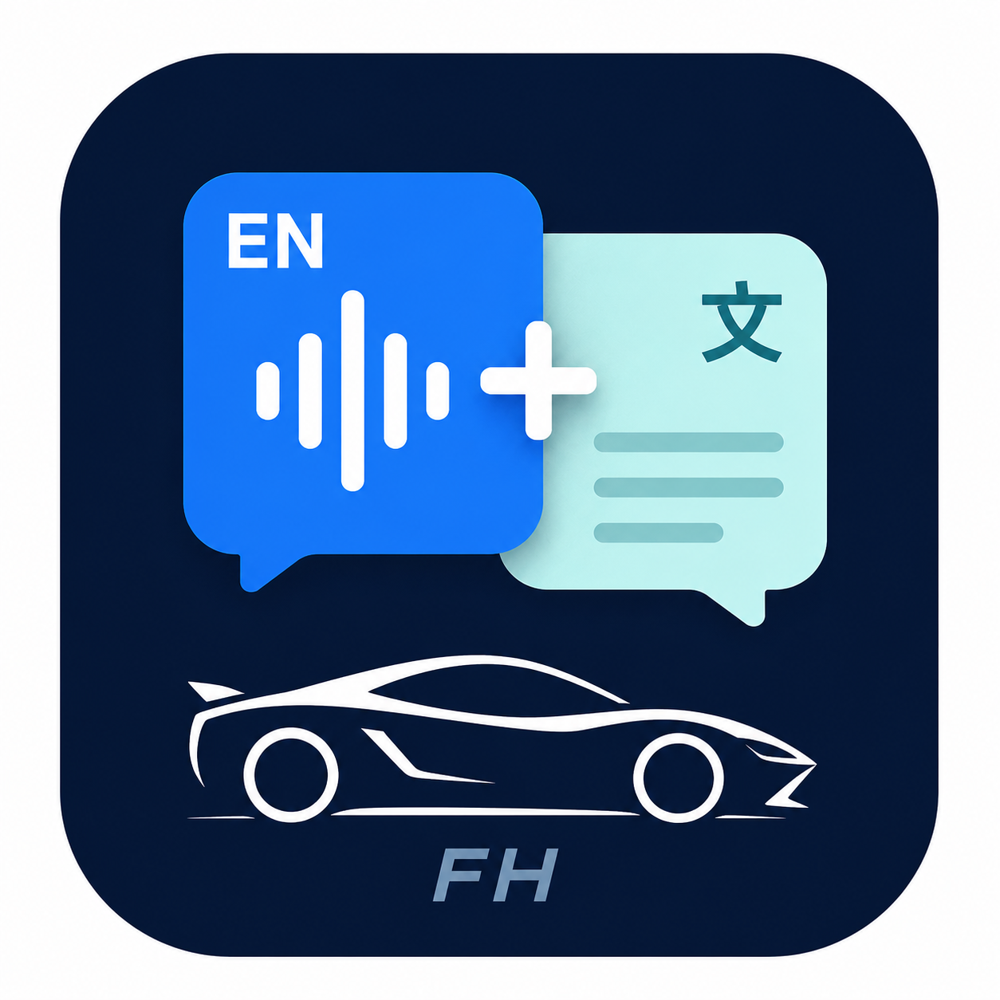
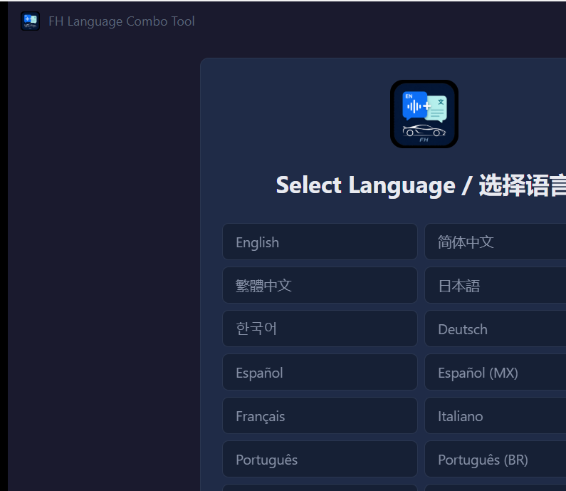

# FH Language Combo Tool

  

  <strong>Use different voice and text languages in Forza Horizon 5 / 6</strong> 
  <strong>在 Forza Horizon 5 / 6 中自由组合语音和文字语言</strong>

  <a href="https://github.com/SiskonEmilia/ForzaHorizonLanguageTool/releases"><b>Download / 下载</b></a>

  

---

## About / 关于

Mix and match voice and text languages in Forza Horizon 5 / 6 (Steam, PC).
For example: Japanese voice + Chinese text, or English voice + Korean text.
One-click apply with automatic backup and restore.

在 Steam 版 Forza Horizon 5 / 6 中自由组合语音和文字语言。
例如：日语语音 + 中文文字，或英语语音 + 韩语文字。
一键应用，自动备份，随时恢复。

## Features / 功能

- **Auto-detect** Steam installations of FH5 and FH6 / 自动检测 Steam 安装的 FH5 和 FH6
- **24 languages** supported for text, 12 for voice / 支持 24 种文字语言，12 种语音语言
- **Auto-backup** before every change / 每次修改前自动备份
- **One-click restore** to undo all changes / 一键恢复所有更改
- **Auto-set game language** in Steam — no manual switching / 自动设置 Steam 游戏语言，无需手动切换
- **24-language UI** — the tool itself supports all game text languages / 工具界面支持全部 24 种游戏文字语言

## Supported Games / 支持游戏

| Game / 游戏 | Steam App ID |
|------|-------------|
| Forza Horizon 5 | 1551360 |
| Forza Horizon 6 | 2483190 |

**Platform / 平台：** Windows 10 22H2+ / Windows 11 — Steam only / 仅 Steam 版

## User Guide / 使用说明

| | | | |
|---|---|---|---|
| [English](docs/guide/EN.md) | [English (UK)](docs/guide/GB.md) | [日本語](docs/guide/JP.md) | [简体中文](docs/guide/CHS.md) |
| [繁體中文](docs/guide/CHT.md) | [한국어](docs/guide/KO.md) | [Deutsch](docs/guide/DE.md) | [Español](docs/guide/ES.md) |
| [Español (MX)](docs/guide/MX.md) | [Français](docs/guide/FR.md) | [Italiano](docs/guide/IT.md) | [Português](docs/guide/PT.md) |
| [Português (BR)](docs/guide/BR.md) | [Русский](docs/guide/RU.md) | [Polski](docs/guide/PL.md) | [Nederlands](docs/guide/NL.md) |
| [Türkçe](docs/guide/TR.md) | [Dansk](docs/guide/DK.md) | [Svenska](docs/guide/SV.md) | [Norsk](docs/guide/NO.md) |
| [Suomi](docs/guide/FI.md) | [Čeština](docs/guide/CZ.md) | [Magyar](docs/guide/HU.md) | [Ελληνικά](docs/guide/EL.md) |

## Disclaimer / 免责声明

This is an unofficial tool, not affiliated with Playground Games, Turn 10 Studios, Xbox, or Microsoft. It only modifies local text resource files. All changes are backed up and fully reversible. Use at your own risk.

本工具为非官方工具，与 Playground Games、Turn 10 Studios、Xbox 或 Microsoft 无关。仅修改本地文字资源文件，所有更改均有备份且完全可恢复。使用风险自负。

## For Developers / 开发者

See [Contributing Guide](docs/dev/CONTRIBUTING.md).

## License

[MIT](LICENSE)
